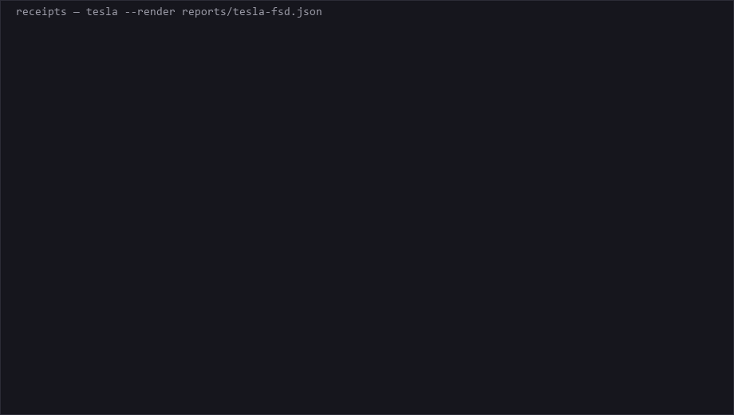

# Receipts

**What a vendor claims, what independent sources report, and which claims nothing corroborates.**

> Written for the Pinetree Research challenge, and built on
> [Solari](https://getsolari.com) cloud browsers. It started as a fork of the
> [Solari cookbook](https://github.com/solari-sdk/solari-cookbook) — the commit
> history begins there, and the MIT licence and copyright are carried forward. The
> cookbook's own examples are not redistributed here; everything in this repository
> apart from that history is original.

Receipts fans a set of cloud browsers across a vendor's own marketing and across
independent writing about it — status pages, Hacker News, Wikipedia, regulators,
review sites — and produces a claim ledger. Every quote in it is verified to be an
exact substring of a page that was actually fetched.

Reddit and G2 are in the source plan and both refuse. G2 sits behind a DataDome device
check that does not solve: zero successes in sixteen controlled attempts, spread across an
hour on each of two proxy tiers. Reddit's challenge does not solve either, and pressing it earns a rate
limit instead. Those attempts are reported as `not read`, with the reason, rather
than quietly narrowing the ledger; the point of naming them is that you can see what the
coverage is missing.

An LLM proposes which claims contradict which. A deterministic gate then re-derives
every quote's position from the bytes we fetched and **discards anything it cannot
find**. The model organises; the sources speak.

### Hosted ledgers

The committed reports are published at
[kristiankrattiger.github.io/receipts](https://kristiankrattiger.github.io/receipts/):

- [Tesla FSD](https://kristiankrattiger.github.io/receipts/tesla-fsd.html) — the showcase
- [Claude](https://kristiankrattiger.github.io/receipts/claude.html) — non-vendor domain
- [Vercel](https://kristiankrattiger.github.io/receipts/vercel.html) — the honest thin ledger

---

## A real ledger



One row, from `npm run cli -- tesla --render reports/tesla-fsd.json`. Tesla's own
safety report against a Hacker News thread — a number on each side:

```
  FSD improves U.S. road safety by over 80%  [road safety improvement]
    tesla       Tesla Vehicle Safety Report
      "FSD (Supervised) improves U.S. road safety by over 80%, reducing the
      likelihood of collisions caused by human error."
    independent Hacker News - robotaxi
      "Tesla 'Robotaxi' adds 5 more crashes in Austin in a month – 4x worse
      than humans"
```

Both halves are verbatim. You can check either: open
[`reports/tesla-fsd.json`](reports/tesla-fsd.json), take the character offsets on
that row, and slice them out of the corresponding document in
[`fixtures/tesla-fsd.json`](fixtures/tesla-fsd.json). If a quote were paraphrased by
a word, the slice would not match — which is the point.

### The finding no single page contains

The Tesla ledger reads three of Tesla's own documents. Split the rows by which one
they cite:

| Tesla source | rows | how they land |
|---|---|---|
| **10-K (FY2024)**, filed with the SEC | 8 | **all 8 `CORROBORATED`** |
| **Vehicle Safety Report**, marketing | 12 | **5 `DIVERGENT`**, 5 unverified, 2 corroborated |

The same company's SEC filing agrees with its critics while its marketing page
contradicts them. The filing says FSD is "certain advanced driver assist systems" and
discloses a class action over "material misrepresentations and omissions about the
Company's Autopilot"; the marketing page says road safety improves "by over 80%".
Neither document is hiding anything — they are written for different readers, and
putting both under one subject is what makes the gap visible.

It is worth saying that this was **not** the predicted result. The
[density plan](docs/superpowers/plans/2026-09-04-density.md) hypothesised that the
10-K would contradict the marketing page directly. It does not: zero rows pair two
Tesla documents against each other. The hypothesis was recorded in advance, so the
null result is visible here rather than quietly dropped.

<details>
<summary>The divergent section in full (unedited)</summary>

```
  DIVERGENT — the vendor's claim is contradicted
  ----------------------------------------------

  Engaging FSD lowers your collision likelihood
    tesla       Tesla Vehicle Safety Report
      "When engaged and under your active supervision, your likelihood of
      being in a collision goes down."
    independent Hacker News - robotaxi
      "Tesla 'Robotaxi' adds 5 more crashes in Austin in a month – 4x worse than humans"

  FSD improves U.S. road safety by over 80%
    tesla       Tesla Vehicle Safety Report
      "FSD (Supervised) improves U.S. road safety by over 80%, reducing the
      likelihood of collisions caused by human error."
    independent Hacker News - robotaxi
      "Tesla 'Robotaxi' adds 5 more crashes in Austin in a month – 4x worse than humans"

  FSD requires only minimal driver intervention
    tesla       Tesla FSD page
      "When enabled, your vehicle will drive you almost anywhere with your
      active supervision, requiring minimal intervention."
    independent Hacker News - FSD
      "Tesla Full Self Driving requires human intervention every 13 miles"

  FSD drives almost anywhere with minimal intervention
    tesla       Tesla Vehicle Safety Report
      "FSD (Supervised) enables your vehicle to drive you almost anywhere with
      your active supervision, requiring minimal intervention."
    independent Hacker News - FSD
      "Tesla Full Self Driving requires human intervention every 13 miles"

  FSD makes driving safer
    tesla       Tesla Vehicle Safety Report
      "Full Self-Driving (Supervised) Keeps You Safer"
    independent Hacker News - FSD
      "Tesla recalls 360k vehicles, says full self-driving beta may cause crashes"

  Tesla's driver-assistance systems set the worldwide standard for safety
    tesla       Tesla Vehicle Safety Report
      "Tesla's combination of passive, active and advanced driver-assistance
      safety systems set the standard for vehicle safety worldwide."
    independent Hacker News - FSD
      "Tesla's 'Full Self-Driving' Beta Software Used on Public Roads Lacks Safeguards"

  [6 UNVERIFIED and 14 CORROBORATED rows follow — see the hosted page]

  audit: proposed 59 over 9 passes · admitted 26 · denied 33
         (15 LOW_CONFIDENCE, 13 DUPLICATE, 5 NOT_QUERY_RELEVANT)
```

Full ledger:
[kristiankrattiger.github.io/receipts/tesla-fsd.html](https://kristiankrattiger.github.io/receipts/tesla-fsd.html).

Rows three and four are the same Tesla claim on two different Tesla pages, each
contradicted by the same thread. Duplicate rows are collapsed *within* a document, not
across them — two pages making one claim is arguably two findings, and suppressing the
second would hide that Tesla says it twice. It is listed here as a judgement call
rather than settled.

</details>

Three things in that output are the whole design:

**The audit line.** Publishing the denial count is what makes the guarantee checkable
rather than a claim. Thirty-three of fifty-nine proposals were rejected, and the
reasons are listed: fifteen below the confidence floor, thirteen already-said, five
off-topic.

**The `UNVERIFIED` section.** Every summariser silently drops claims it cannot check.
A vendor claim that no independent source corroborates is a *finding*, not an
absence, so it gets its own section and says so. "Our fleet collectively experiences a
lifetime of driving scenarios in 10 minutes" is not contradicted here — it is simply
uncheckable against anything that would talk to us.

**`not read` sources.** Coverage is always partial, and partial coverage stated out
loud beats a report that quietly looks complete. On the Tesla run all ten sources read;
on Vercel, G2 returned a challenge it did not solve that time, and Reddit rate-limited
us.

### A second vendor

Same engine, no per-vendor code, from
`npm run cli -- vercel --render reports/vercel.json`:

```
  DIVERGENT — the vendor's claim is contradicted
  ----------------------------------------------

  Vercel positions itself as purpose-built for secure development  [security posture]
    vercel      Vercel security page
      "Purpose-built for secure development, Vercel allows you to build,
      deploy, and protect applications with our suite of security features."
    independent Wikipedia - Vercel
      "On April 19, 2026, Vercel disclosed a security breach in which certain
      internal systems were accessed by unauthorized actors."

  sources
    ...
    not read    G2 reviews  (empty)
    not read    Reddit - r/nextjs  (blocked)

  audit: proposed 22 over 7 passes · admitted 10 · denied 12 (11 LOW_CONFIDENCE, 1 DUPLICATE)
```

Vercel's ledger is the honest weak one, and worth keeping for that reason. Nine of its
ten rows are `UNVERIFIED`. Its source plan reads ten documents — a security page,
pricing, limits docs, changelog, status history, Wikipedia, two Hacker News searches
and a GitHub issue search — and still turns up **one** divergence.

That is not a tuning failure. Eleven proposals were denied below the confidence floor,
most of them under 0.35, meaning the model looked and did not find much. A ledger is
only as sharp as the independent record, and there is far less written about Vercel
than about Tesla. Reporting a thin result as a thin result is the whole point; the
alternative is a tool that always finds something.

## Not only vendors

Nothing in the engine is vendor-specific. The admission gate contains no role logic
at all: a document is either a `claimant` — whoever is making the claims — or
`independent`, and the only thing that differs between domains is what those two are
*called* in the output.

So a new domain is a JSON file, not a code change:

```json
{
  "subject": "Claude",
  "labels": { "claimant": "Model card", "independent": "Independent" },
  "targets": [
    { "kind": "vendor_site", "role": "claimant",
      "url": "https://www.anthropic.com/claude", "label": "Claude product page" },
    { "kind": "forum", "role": "independent",
      "url": "https://hn.algolia.com/?q=anthropic.com", "label": "Hacker News" }
  ]
}
```

[`plans/ai-model-claims.json`](plans/ai-model-claims.json) is a worked example — a
model vendor's own product page, pricing and model docs against its status page and
Hacker News. The ledger then reads *Model card* where it would otherwise read
*Vendor*.

It reads **6 of 6 sources**, captured in [`fixtures/claude.json`](fixtures/claude.json):

```
read  Model overview docs        4825 chars   Model card
read  Claude product page        4691 chars   Model card
read  Anthropic pricing          5730 chars   Model card
read  Anthropic status page      6672 chars   Independent
read  Hacker News               39532 chars   Independent
read  Hacker News — benchmarks  26422 chars   Independent

6 read, 0 failed
```

No engine changes were involved — one JSON file, and the same pipeline that reads SaaS
vendors reads an AI lab. The ledger it produces is in
[`reports/claude.json`](reports/claude.json):

```
  DIVERGENT — the vendor's claim is contradicted
  ----------------------------------------------

  Fable 5.1 is the model to use for demanding reasoning work  [Fable 5.1 for demanding reasoning]
    model card  Model overview docs
      "Use Claude Fable 5.1 for demanding reasoning and long-horizon agentic work"
    independent Hacker News — benchmarks
      "We have seen the best results with Gemini models for visual reasoning,
      achieving SOTA (beating Claude Fable) on the strongest grounded
      reasoning benchmark we have found (Databricks OfficeQA)."

  A production model (Mythos 5) not listed in the docs lineup is serving requests
    model card  Model overview docs
      "Claude is a family of state-of-the-art large language models developed
      by Anthropic. Compare the current lineup, find the model ID for every
      platform, and open each model's page for its full specs and resources."
    independent Anthropic status page
      "We are investigating elevated errors on requests to Claude Mythos 5,
      Claude Fable 5, Claude Opus 5, and Claude Opus 4.8."

  audit: proposed 18 over 5 passes · admitted 11 · denied 7 (4 LOW_CONFIDENCE, 3 DUPLICATE)
```

The second row is the kind of finding this shape is for, and no single page contains
it. The docs page offers to show you "the current lineup"; the status page, reporting
an incident, names a production model that is not in it. Neither source is making an
accusation — the ledger is, by putting them side by side.

Five of the eleven rows are `UNVERIFIED`: pricing, speed and modality claims that
nothing in this corpus corroborates either way.

### The bug this domain exposed

Earlier still, before the check described here existed, the same corpus reported
*four* corroborations. Three cited Hacker News results whose links pointed back at
`anthropic.com` — the vendor's own announcements, labelled `Independent` because the
page containing them was an aggregator. (The fourth was evidenced by the bare words
`"Claude Sonnet 5"`, which took a second gate — see [the guarantee](#the-guarantee) —
and a later run to remove.)

**An aggregator is a conduit, not a source.** A press release does not become
third-party confirmation by being posted to Hacker News, and a report that says
otherwise is doing the exact thing this tool exists to prevent.

It is fixed at both ends, because they do different jobs. The prompt tells the
cartographer that an aggregator result linking to the claimant's own domain is not
corroboration — that stops the proposals. The gate enforces it independently: a span
from an independent document carrying a URL that points at a claimant domain is denied
`SELF_SOURCED`, with claimant domains derived from the claimant documents' own URLs.
A gate that only holds when the model complies is not a gate.

It is deliberately a *link* check, not a mention check: an independent commenter
writing "anthropic.com was down for an hour" is real testimony and still counts.
It also knows only the domains a plan actually names — there is a test asserting that
gap exists, so it is not mistaken for coverage.

The same shape fits anywhere one party makes checkable claims and independent sources
can be read against them — employer claims against Blind and Glassdoor, model
benchmark tables against independent evals, a product's spec sheet against teardowns.

One guard worth knowing about: a plan containing only one role is **refused before any
browser starts**. It would otherwise run, spend money, and produce a report where
everything is `UNVERIFIED` — not because the subject is unverifiable, but because
nothing was present that could contradict anything. That failure looks like a result,
which is worse than an error.

---

## Why cloud browsers

The sources worth reading are the ones that refuse automation. Measured against
`vercel.com` on a paid Solari plan with stealth on and `--proxy smart`:

| Source | Result |
|---|---|
| vendor homepage, security, pricing, limits docs, changelog | read |
| status history | read |
| Wikipedia | read — 13k characters, including the April 2026 breach |
| Hacker News (two searches) | read — 36k characters |
| **GitHub issues** on `vercel/next.js` | read — practitioners, dated, specific |
| G2 | a DataDome device check; 0 reads in 16 controlled attempts across two tiers |
| Reddit | a challenge that does not solve; pressing it earns a rate limit |

GitHub issues are the entry that matters. Reddit and G2 were meant to be "where users
complain" and both refuse; a project's own issue tracker is the same complaints,
written by people who can reproduce them, on a site that answers a browser.

That run predates the egress measurement below, and used `--proxy smart`, which has
since been shown to attach no proxy. Its Reddit row in particular said "blocked" when
the truth was "we arrived from a datacenter IP".

And on the **free plan**, where stealth is not available, the same run reads the
vendor's own three pages and **zero independent sources**. Reddit answers with
"You've been blocked by network security"; everything else returns nothing.

That is the honest shape of this problem: a tool that only reads what a company says
about itself is not a diligence tool. Stealth and proxy egress are not a nice-to-have
here — they are the difference between one side of the ledger and two.

### Pick the proxy tier, not just the country

Solari offers three proxy tiers — `residential` (its default), `static` and
`mobile` — and `--proxy` reaches them as `country:tier`:

```bash
npm run cli -- stripe --proxy us:static     # a fixed ISP IP
npm run cli -- stripe --proxy gb            # country only; Solari's default tier
npm run cli -- stripe --proxy smart         # let Solari choose (the default here)
```

This matters more than a tuning knob should, because an unavailable tier does not
report itself as unavailable. It surfaces as `ERR_TUNNEL_CONNECTION_FAILED` on
`page.goto`, which this tool classifies as `proxy_error` against **every** source at
once — a report that reads as "nothing on the web will talk to us". Measured against
`tesla.com/fsd` on this account:

| `proxy` | Result |
|---|---|
| `us` (bare code → residential) | tunnel connection failed |
| `{ country: us, tier: residential }` | tunnel connection failed |
| `{ country: us, tier: mobile }` | tunnel connection failed *(2026-09-04; mobile worked on 2026-09-05, see below)* |
| `{ country: gb }` | tunnel connection failed |
| `{ country: us, tier: static }` | **read, 3924 chars** |
| `smart` | **read, 3924 chars** |

Both US and GB residential failed while US static read the page, so the country was
never the variable. If a whole run comes back `proxy_error`, try another tier before
concluding the sources are hostile — and if the failures are uniform across every
host, they almost certainly are not about the hosts.

**Read the last two rows carefully: they do not say what they appear to.** Every cell
was measured against `tesla.com/fsd`, which blocks nothing and returns the same page
with no proxy at all. "Read, 3924 chars" therefore establishes that the page loaded and
nothing whatever about the route it took — which is exactly why `static` and `smart` are
indistinguishable here. The table separates *broken* from *working*; it cannot separate
*proxied* from *unproxied*, and it was used to pick a default as though it could.

The check that would have caught it is one line, and Solari's own documentation names
it: a proxied session comes back with `session.proxy` populated, so confirm that field
rather than a status code.

### What the egress actually is, measured

`npm run egress` reads `session.proxy` back on every cell. Run 2026-09-05, full results
in [`reports/egress-2026-09-05.json`](reports/egress-2026-09-05.json):

| host | `--proxy smart` | `--proxy us:static` | `--proxy off` |
|---|---|---|---|
| Wikipedia | proxy **NONE**, 200, 12,817 chars | proxy `us/static`, 200, 12,817 chars | proxy **NONE**, 200, 12,817 chars |
| `tesla.com/fsd` | proxy **NONE**, 200, 4,232 chars | proxy `us/static`, 200, 4,232 chars | proxy **NONE**, 200, 4,232 chars |
| G2 | proxy **NONE**, **403**, 0 chars | proxy `us/static`, **403**, 0 chars | proxy **NONE**, **403**, 0 chars |
| Reddit | proxy **NONE**, **403** blocked | proxy `us/static`, **200** — challenge | proxy **NONE**, **403** blocked |

**`smart` is `off`.** Not approximately — its rows are byte-identical to `off` on every
host, and the session confirmation came back `NONE` every time. The default that this
README previously recommended was no proxy at all, and the tesla.com table above is
precisely why nobody noticed. The default is now `us:static`.

**Reddit was never refusing us on the merits.** It was refusing an unproxied datacenter
IP. Behind a real proxy it answers `200` — and then asks us to prove we are human. That
is a different fact about Reddit than "blocked", and this repository asserted the wrong
one for a week.

**G2 is unchanged by the proxy.** `403` with a 2,638-character body, identical across all
three settings. A proxy is not the missing ingredient — a solver is, and only sometimes;
see the access stance below.

**`webBotAuth` does not exist here.** It is in the SDK's types, and the API rejects it:
`400 — "Web Bot Auth request signing is not available on this platform; requests were
never signed even when this option was accepted."` Worth knowing that it was previously
accepted and silently inert.

---

## Six more source classes, probed before committing

Reddit and G2 were never the only candidates. Six source classes were proposed for
this branch; each URL below was fetched and read before it was added anywhere, and a
rejection is recorded with its outcome rather than dropped quietly — the `not read`
column is the product.

| Source | Result |
|---|---|
| Downdetector | **added to every future subject's defaults.** Probed against Vercel, it read real subject-specific content: "User reports show no current problems with Vercel", plus a 24-hour report chart (2,330 chars). |
| BBB | **not added.** The URL shape works, but a vendor with no BBB profile returns "No results for" … "Vercel" (a line break sits between the two, not the joined sentence this once implied) wrapped in 1,841 characters of navigation chrome — not an independent source, a search page. |
| Tesla — NHTSA recalls API | **added to `plans/tesla-fsd.json`.** 5,835 characters of dated recall summaries filed with a federal regulator, verified on two model/year pairs before being committed. |
| Claude — LMArena leaderboard | **added to `plans/ai-model-claims.json`.** 41,500 characters, 88 mentions of Claude carrying comparative scores with confidence intervals — the independent counterweight a model card's own claims never have. |
| CourtListener | **not added.** Bot-challenged: "Let's confirm you are human" … "Complete the security check before continuing." (318 chars; a paragraph break sits between the two sentences, not the period this once implied). The spec argued for it over PACER because it is free and needs no login — true, and irrelevant: free access and machine-readable access are different properties. |
| Artificial Analysis | **not added.** The guessed benchmark-aggregator URL for Claude returned a 404. |
| Vercel — independent measurement source | **none found.** Inventing one to fill the slot is exactly the failure this tool exists to expose. |

The industry-regulator lookup table (`src/sources/regulators.ts`) is written and
tested, and its one industry, `automotive`, ships **empty**. Its seeded entry pointed
at `nhtsa.gov/recalls?make=<subject>`; the probe showed that parameter is ignored
outright — zero occurrences of "Tesla" in 8,452 characters of generic landing page.
The NHTSA URL that does carry recall text needs `make` **and** `model` **and**
`modelYear`; `make` alone returns `Count:0`. Two of those three cannot be derived
from a company name, so that URL lives in Tesla's plan file instead of the table.
**Nothing calls this mechanism yet** — the CLI, the MCP server and the web server
all build a source plan without an `industry` argument, and no CLI flag or plan-file
field supplies one — so it is an empty table sitting behind an unwired parameter,
waiting on a regulator that is genuinely name-derivable from a company name alone.

**Two production defects, both found by these probes, both fixed here.** BBB's
"No results" page cleared the no-results gate because the bound was 600 characters
against its own 1,841 — entering the corpus as a readable independent source.
Raising the bound to 4,000 alone would have let a second defect back in: "0 results"
is a bare substring, so a *populated* search page reporting "20 results" or "1,240
results" would trip the same gate at that length. An earlier revision tried to
handle "no results" grammatically — flag it unless a verb follows — on the theory
that a search page says it of itself while prose adds a verb. Measured, that was
wrong in both directions: "No results were found for your search" is a search page
*with* the verb, and the commonest empty-search wording on the web, while "no
results whatsoever were found" is an article whose adverb slips past the lookahead.
The check is now what it always should have been: a list of phrasings that name a
page's own search, with the numeric one (`0 results`) anchored to a word boundary so
it cannot match inside a populated page's count. CourtListener's 318-character
challenge page matched none of the existing CAPTCHA markers — its "confirm you are
human" against the list's "verify you are human", its "complete the security check"
against "complete the challenge" — so it cleared the 200-character floor and
classified as a readable independent document. Both phrasings are now in the list.
These were the **fourth and fifth** instance of the same class of bug in
`src/fetch/fan.ts`: a refusal or emptiness page entering the corpus as if it were a
document. All five were found by a live run, never by reading the code — and then a
review of this very branch found a **sixth** by reading: the grammatical lookahead
above, which classified "No results were found for your search" as a readable
document. Five to one is still the ratio, but the sixth is the reason the claim is
now "runs find what reading misses" rather than "only runs find these".

---

## What this tool does to read a source that refuses

It solves challenges. Solari's managed captcha solving is on by default; `--no-captcha`
turns it off. That is a reversal of this project's original position, which was to refuse
on principle and report the source as `not read`.

**What changed the position was a measurement, and it is worth reading before you trust
either version.** The original rule was written believing Reddit and G2 refused us on the
merits. Neither did. Reddit was refusing an unproxied datacenter IP, because our own proxy
default silently attached no proxy at all. G2's "hard 403" was a challenge interstitial
that our extractor abandoned after 1.4 seconds. The rule was declining a remedy for a
condition nobody had diagnosed.

**What it bought, measured 2026-09-05:** nothing that survives repetition. The first run
read G2 once in four attempts. A controlled follow-up — eight attempts spaced across an
hour, all verified proxied, in
[`reports/captcha-probe-2026-09-05.json`](reports/captcha-probe-2026-09-05.json) — read it
**zero** times, and identified the obstacle: a DataDome device check in a cross-origin
iframe, which Solari covers only site-by-site. A second controlled run on `us:mobile`
([`reports/captcha-probe-2026-09-05-us-mobile.json`](reports/captcha-probe-2026-09-05-us-mobile.json))
read it zero times too, closing the one alternative the first run could not rule out — that
the exit IP's reputation, rather than the challenge, was what blocked us. Sixteen attempts,
two tiers, no reads. DataDome's own verdict was identical on both — same rule-set hash, same
bootstrap — and only our rendering of it differed, so this rules out neither the exit's
reputation nor the browser fingerprint, which was held fixed throughout. What it establishes
is narrower and sufficient: no lever this account has reads G2.
Reddit does not read either, and sustained attempts produce `429`-style rate limiting.

So the reversal bought no reliable coverage at all. The `not read` column was never the
reason coverage was thin, and the honest version of this section is that the constraint it
replaced was costing almost nothing.

**Reddit was also tried through its API — twice, not once.** An OAuth path
(`client_credentials`, no user account) was built and reviewed, on the theory that an
application token is Reddit's sanctioned way in and removes the account-automation risk a
login flow would carry. It has never been exercised: Reddit's script-app registration page
fails its own reCAPTCHA silently and consistently — across browsers, with and without
extensions and third-party cookies, no image challenge ever appearing. A known failure mode
of that page, not a configuration problem here.

Rather than leave Reddit unread while that stays broken, a second, credential-free path was
added: Reddit's public `/search.json` endpoint, the interface RSS readers and old API
clients have used for years. Measured 2026-09-06 against `plans/vercel.json`:
`www.reddit.com` — the same hostname the browser path could not get past — refused this one
too, though not from the same vantage point: this fetch is a bare, unproxied HTTP request, and
`fixtures/vercel.json`, which recorded the browser's own Reddit attempt, carries no egress
information for it at all. What that fixture does show is the same "You've been blocked by
network security... log in to your Reddit account or use your developer token" wording this
README already attributes elsewhere to an unproxied attempt — so both refusals plausibly came
from an unproxied vantage point, though neither run recorded its egress precisely enough to
say for certain.
`403`, `reddit refused the request (403)` — and that is the entire evidence: the 403 branch
throws before reading the response body, so nothing here observed what Reddit's response
actually said, only its status code. Two different requests against two different sub-paths of
the same host, refused in two different shapes: a rendered block page naming a login route,
and a bare 403 naming nothing. Neither path has
produced a single Reddit read. Reddit stays `not read`, and the OAuth path remains the one
worth returning to if the registration page ever stops failing.

**What has not changed, and will not:** a source that cannot be read still says why, in
the ledger, with the reason it actually returned. This tool's claim was never that it can
read everything — it is that it tells you exactly what it could and could not read, and
how. Reading a source without saying how is the thing that would break it.

---

## What it costs

| Component | Estimate |
|---|---|
| Browser fan, ~7 sources | a few cents |
| One Claude Opus call at 40 candidates | ~$0.14 |
| **Per full run** | **~$0.18** |

`--candidates` tunes how much of the corpus the model sees and is the main cost lever.
`--fetch-only` and `--render` cost nothing beyond browser time and nothing at all
respectively.

**One caveat worth stating plainly:** results vary between runs. The same fixture at
the same settings produced two rows on one run and four on another. An LLM proposer is
not deterministic, so a single run is not a reliable read of a vendor — treat it as a
lead, not a verdict.

---

## Lineage

The epistemic design is ported from **GIN**, a federated grounded-reasoning system.
Three ideas carry over:

- **Productive divergence.** When sources disagree, surface the disagreement rather
  than averaging it away. Divergent findings are rendered with both sides together,
  always.
- **Exact attribution by construction.** GIN's SEAR layer constrains generation to
  spans occurring verbatim in a corpus. Receipts gets the same guarantee with
  post-hoc exact-substring verification — no constrained decoding, no local model.
- **Layer separation.** Propose, admit, render are three modules with typed
  interfaces, so no layer can inflate its own record.

Deliberately *not* ported: the Postgres/pgvector corpus tier, embeddings, and the
learned frame detector — GIN's own measurements record that detector failing its
escalation bar, and vendor-claim-versus-user-report divergence is exactly the class it
failed on.

Full design: [`docs/superpowers/specs/2026-08-31-receipts-design.md`](docs/superpowers/specs/2026-08-31-receipts-design.md),
and the build plan it was executed from:
[`docs/superpowers/plans/2026-08-31-receipts.md`](docs/superpowers/plans/2026-08-31-receipts.md).

---

## Browsers only

Solari offers browsers, sandboxes, and desktops. This uses browsers and nothing else.

Every honest use here is a browser use, and adding a sandbox to touch a second
primitive would be decoration — the kind of thing reviewers who build this
infrastructure spot immediately. The constraint is the point.

---

## Development

```bash
npm test        # 269 tests
npm run typecheck
```

Everything except `fetch/` is a pure function of a captured corpus, so the whole
engine is testable offline against committed fixtures — no key, no network, no cost.
`fixtures/` holds real captures: `vercel.json` and `claude.json` (both roles
populated, and both with ledgers in `reports/`), plus `solari-free-plan.json` — a
vendor with no third-party footprint at all, which the tool correctly reports as an
absence of coverage rather than a clean bill of health.

MIT licensed.
